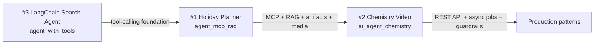

<p align="center">
  
</p>

# Agentic AI

A collection of personal projects exploring **agentic AI**, **LLM applications**, and **production-style Python backends**. Each project is self-contained with its own virtual environment, dependencies, README cover, and documentation.

The repo includes three projects at increasing scope: a flagship **Holiday Planner** (MCP + RAG), an **async video-generation API**, and a **LangChain Search Agent** (interactive CLI + Tavily web search).

**Recommended quick start order:** #1 Holiday Planner → #2 Chemistry Video → #3 LangChain Search Agent.

---

## Projects

| # | Project | What it does | Stack highlights | Docs |
|---|---------|--------------|------------------|------|
| 1 | [`agent_mcp_rag/`](agent_mcp_rag/) | Holiday planning assistant: brief → personalized itinerary, scene previews, PDF deliverable | LangChain ReAct, FastMCP, Chroma RAG, Tavily, fpdf2 | [README](agent_mcp_rag/README.md) |
| 2 | [`ai_agent_video_generation/ai_agent_chemistry/`](ai_agent_video_generation/ai_agent_chemistry/) | Async API that turns chemistry questions into narrated explainer videos | FastAPI, Pillow, gTTS, ffmpeg | [README](ai_agent_video_generation/ai_agent_chemistry/README.md) |
| 3 | [`agent_with_tools/`](agent_with_tools/) | LangChain Search Agent: interactive CLI that answers client questions via ReAct + Tavily `web_search` | LangChain, Tavily, Gemini / OpenRouter / OpenAI | [README](agent_with_tools/README.md) |

Each project README includes a cover image, **How this project fits** table, setup guide, and architecture notes.

---

## How the projects relate

The **quick start order** (#1 → #2 → #3) is the recommended way to explore the repo: start with the full Holiday Planner, then the video API, then the LangChain Search Agent.

The diagram below is a **conceptual stack** — how ideas build on each other — not the order you run them:



| # | Project | Role in the stack |
|---|---------|-------------------|
| **1** | `agent_mcp_rag` | Flagship agent: MCP tool server, Chroma RAG memory, Tavily search, structured deliverables (JSON, Markdown, PDF, scene images). |
| **2** | `ai_agent_chemistry` | Service layer: same artifact mindset as #1, but exposed as FastAPI with background jobs, manifests, and evaluation. |
| **3** | `agent_with_tools` | Smallest slice: LangChain Search Agent with one `web_search` tool, interactive CLI, and multi-provider LLM support — the pattern that #1 extends into a full MCP workflow. |

**Quick start vs diagram:** run **#1 → #2 → #3** to see the most complete projects first; read the diagram **#3 → #1 → #2** to understand how complexity grows from basic tool-calling to a deployable API.

---

## Repository layout

```text
agentic_ai/
├── README.md
├── assets/
│   └── readme-cover.png               # root cover
├── agent_mcp_rag/                     # #1 Holiday Planner (MCP + RAG)
│   ├── README.md
│   ├── Makefile
│   ├── requirements.txt
│   ├── assets/readme-cover.png
│   ├── data/                          # mock chat history + Chroma store
│   ├── artifacts/                     # per-run archives (generated)
│   ├── final_plan/                    # latest deliverable (generated)
│   └── src/
│       ├── agent.py
│       ├── server.py                  # MCP server
│       ├── rag/
│       └── planner/
├── ai_agent_video_generation/
│   ├── Makefile
│   ├── .venv/                         # venv for chemistry subproject
│   └── ai_agent_chemistry/            # #2 Chemistry Video API
│       ├── README.md
│       ├── ARCHITECTURE.md
│       ├── Makefile
│       ├── .env.example
│       ├── assets/readme-cover.png
│       ├── artifacts/                 # MP4s, manifests (generated)
│       └── app/
└── agent_with_tools/                  # #3 LangChain Search Agent
    ├── README.md
    ├── Makefile
    ├── requirements.txt
    ├── .env.example
    ├── assets/readme-cover.png
    └── src/
        └── agent.py                   # ReAct agent + web_search + CLI
```

---

## Prerequisites

- **Python 3.11+**
- **API keys** (per project — see [Environment variables](#environment-variables-summary))
- **ffmpeg** (recommended for chemistry video playback): `brew install ffmpeg` on macOS

### Virtual environments

| Project | `.venv` location |
|---------|------------------|
| `agent_mcp_rag` | `agent_mcp_rag/.venv` |
| `ai_agent_chemistry` | `ai_agent_video_generation/.venv` |
| `agent_with_tools` | `agent_with_tools/.venv` |

There is no shared root virtual environment. Copy `.env.example` where provided before your first run.

---

## Quick start by project

### 1. Holiday Planner Agent (MCP + RAG)

Turns a short client brief into a trip plan with RAG-backed preferences, Tavily research, destination scene cards, and a PDF.

```bash
cd agent_mcp_rag
make install
source .venv/bin/activate
```

Create `agent_mcp_rag/.env`:

```env
OPEN_ROUTER_AI_API_KEY=your_openrouter_key
TAVILY_API_KEY=your_tavily_key
```

Optional — use Google Gemini instead:

```env
LLM_PROVIDER=google
GOOGLE_API_KEY=your_gemini_key
LLM_MODEL=gemini-2.5-flash
```

Optional run configuration:

```env
CLIENT_ID=maria
WORK_ID=optional-fixed-uuid
```

Seed mock client memory (first run; also auto-seeds when Chroma is empty):

```bash
make seed-memory
```

Run the agent:

```bash
make run-agent
```

**Outputs:** latest plan at `agent_mcp_rag/final_plan/`; per-run archives under `artifacts/`.

Full setup, MCP tool reference, and example brief: [`agent_mcp_rag/README.md`](agent_mcp_rag/README.md).

| Makefile target | Description |
|-----------------|-------------|
| `make install` | Create `.venv` and install dependencies |
| `make activate` | Print `source .venv/bin/activate` |
| `make seed-memory` | Load mock chat history into Chroma |
| `make run-agent` | Run the holiday planner |
| `make clean` | Remove generated `data/chroma`, `artifacts/`, `final_plan/` |
| `make reinstall` | Remove `.venv` and install fresh |
| `make clean-venv` | Remove local `.venv` |
| `make help` | List all targets |

---

### 2. AI Chemistry Video API

Async FastAPI service that accepts a chemistry question and produces an MP4 explainer (slides + narration).

```bash
cd ai_agent_video_generation/ai_agent_chemistry
make install
source ../.venv/bin/activate
make run-api
```

Or from the parent folder:

```bash
cd ai_agent_video_generation
make install
make run-api
```

Open interactive docs at [http://localhost:8000/docs](http://localhost:8000/docs).

Example request:

```bash
curl -X POST localhost:8000/v1/videos \
  -H "Content-Type: application/json" \
  -d '{"query":"How does the pH scale work?","topic":"chemistry"}'

curl localhost:8000/v1/videos/<job_id>
curl -OJ localhost:8000/v1/videos/<job_id>/artifact
```

Run tests:

```bash
make test
```

Full API reference, playback notes, and cost breakdown: [`ai_agent_video_generation/ai_agent_chemistry/README.md`](ai_agent_video_generation/ai_agent_chemistry/README.md).

| Makefile target | Description |
|-----------------|-------------|
| `make install` | Create `ai_agent_video_generation/.venv` |
| `make activate` | Print `source .venv/bin/activate` |
| `make run-api` | Start FastAPI on port 8000 (reload) |
| `make test` | Run pytest suite |
| `make reinstall` | Remove `.venv` and install fresh |
| `make clean-venv` | Remove `ai_agent_video_generation/.venv` |
| `make help` | List all targets |

---

### 3. LangChain Search Agent

A ReAct agent with a Tavily `web_search` tool — answers client questions in **interactive** or **single-shot** mode. The agent decides when to search the web, synthesizes an answer, and cites sources.

```bash
cd agent_with_tools
cp .env.example .env   # add your API keys
make install
source .venv/bin/activate
make run-agent
```

Create `agent_with_tools/.env`:

```env
TAVILY_API_KEY=your_tavily_key
GOOGLE_API_KEY=your_gemini_key
```

Optional — OpenRouter or OpenAI instead of Gemini:

```env
LLM_PROVIDER=openrouter
OPEN_ROUTER_AI_API_KEY=your_openrouter_key
LLM_MODEL=meta-llama/llama-3.3-70b-instruct:free
```

**Interactive mode** (default) — keeps prompting until you type `exit`, `quit`, or `q`:

```bash
make run-agent
# or: cd src && python agent.py -i
```

**Single question:**

```bash
cd src && python agent.py "What is the latest news about agentic AI?"
```

Or set `USER_QUERY` in `.env` and run `make run-agent`.

Full setup, configuration, and architecture: [`agent_with_tools/README.md`](agent_with_tools/README.md).

| Makefile target | Description |
|-----------------|-------------|
| `make install` | Create `.venv` and install dependencies |
| `make run-agent` | Run interactive search agent (`ARGS="your question"` for one-shot) |
| `make activate` | Print `source .venv/bin/activate` |
| `make reinstall` | Remove `.venv` and install fresh |
| `make clean-venv` | Remove local `.venv` |
| `make help` | List all targets |

---

## Environment variables (summary)

| # | Project | Required | Optional |
|---|---------|----------|----------|
| 1 | `agent_mcp_rag` | `OPEN_ROUTER_AI_API_KEY` (or `GOOGLE_API_KEY` with `LLM_PROVIDER=google`), `TAVILY_API_KEY` | `LLM_PROVIDER`, `LLM_MODEL`, `CLIENT_ID`, `WORK_ID`, `USER_BRIEF` |
| 2 | `ai_agent_chemistry` | None for template-based generation | `USE_LLM_SCRIPT=1`, `ARTIFACT_DIR`, `APP_HOST`, `APP_PORT` — see `.env.example` |
| 3 | `agent_with_tools` | `TAVILY_API_KEY`, `GOOGLE_API_KEY` (when `LLM_PROVIDER=google`) | `LLM_PROVIDER`, `LLM_MODEL`, `OPEN_ROUTER_AI_API_KEY`, `OPENAI_API_KEY`, `USER_QUERY` |

Never commit `.env` files or API keys. They are listed in `.gitignore`.

---

## Generated artifacts

These paths are created at runtime and are typically gitignored or cleaned via Make targets:

| Path | Project | Contents |
|------|---------|----------|
| `agent_mcp_rag/final_plan/` | Holiday Planner | Latest PDF, JSON, Markdown, scene images |
| `agent_mcp_rag/artifacts/` | Holiday Planner | Per-run scene and PDF archives |
| `agent_mcp_rag/data/chroma/` | Holiday Planner | Chroma vector store |
| `ai_agent_chemistry/artifacts/` | Chemistry Video | MP4s, manifests, intermediate slides/audio |

`agent_with_tools` is stateless — no on-disk artifacts beyond optional LangSmith traces.

---

## License

See [LICENSE](LICENSE).
