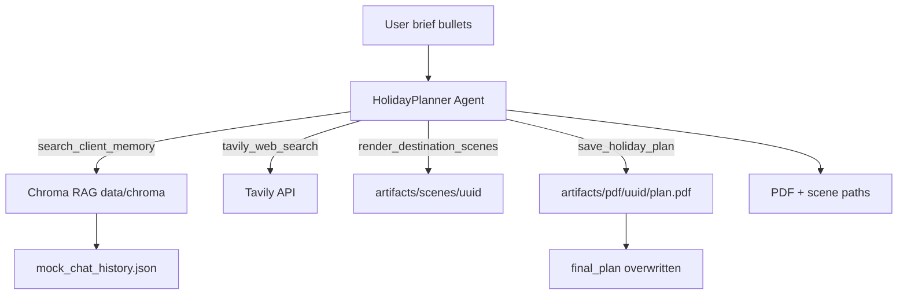

# Holiday Planner Agent

A holiday planning assistant that turns short client briefs into detailed trip plans with personalized recommendations, day-by-day agendas, destination scene previews, and a PDF deliverable.

## Requirements (Original Brief)

1. **Holiday planning assistant** — accepts brief client input (interests, food, budget, favorite places, season, etc.) and produces detailed plans with agenda and destination information.
2. **Scene previews** — generate 3–5 scene images per trip using Tavily image search + PIL composition cards.
3. **RAG memory** — remember historical chats via Chroma vector store; mock past conversations seed client habits and preferences.
4. **MCP tools** — Tavily web search and local planner tools exposed through FastMCP.
5. **Local persistence** — per-run UUID folders under `artifacts/`; latest deliverable overwritten in `final_plan/` (project root).
6. **This document** — single source of truth for setup, architecture, and usage.

---

## Setup

### Prerequisites

- Python 3.11+
- API keys in `.env` at project root (`agent_mcp_rag/.env`):

```env
OPEN_ROUTER_AI_API_KEY=your_openrouter_key
TAVILY_API_KEY=your_tavily_key
```

Optional — use Google Gemini free tier instead of OpenRouter:

```env
LLM_PROVIDER=google
GOOGLE_API_KEY=your_gemini_key
LLM_MODEL=gemini-2.5-flash
```

Optional run configuration:

```env
CLIENT_ID=maria
WORK_ID=optional-fixed-uuid
```

Note: keep `.env` as simple `KEY=value` lines only. Shell/curl examples in the same file will trigger dotenv parse warnings.

### Install

Each project has its own `.venv` inside the project folder.

```bash
cd agent_mcp_rag
make install
source .venv/bin/activate
```

This creates `agent_mcp_rag/.venv` and installs `requirements.txt`.

### Seed mock chat memory (first run)

```bash
make seed-memory
```

Or seed is auto-run on agent startup when Chroma is empty.

### Run the agent

```bash
make run-agent
```

Or directly (with this project's venv activated):

```bash
cd agent_mcp_rag/src && python agent.py
```

---

## LLM (Free Models)

Default provider is **OpenRouter** with a free model:

| Setting | Default |
|---------|---------|
| `LLM_PROVIDER` | `openrouter` |
| `LLM_MODEL` | `meta-llama/llama-3.3-70b-instruct:free` |

Other free OpenRouter options you can try:

- `google/gemma-3-27b-it:free`
- `qwen/qwen3-4b:free`

For Google Gemini free tier, set `LLM_PROVIDER=google` and `LLM_MODEL=gemini-2.5-flash`.

---

## Architecture



### Agent workflow

1. Parse client brief (interests, food, budget, season, etc.)
2. `get_client_profile` + `search_client_memory` — retrieve habits from mock history
3. `tavily_web_search` — research destinations, food, attractions, seasonal tips
4. Synthesize structured trip plan (agenda, budget, food, packing)
5. `render_destination_scenes` — 3–5 PIL cards with Tavily photos → `artifacts/scenes/{uuid}/`
6. `save_holiday_plan` — write JSON/Markdown, build PDF, publish to `final_plan/`
7. Return summary with file paths

Each run generates a new **work UUID** (unless `WORK_ID` is set). Historical runs are kept under `artifacts/scenes/` and `artifacts/pdf/`.

---

## Output Locations

| Artifact | Path | Notes |
|----------|------|-------|
| **Latest deliverable (PDF)** | `final_plan/plan.pdf` | **Overwritten every re-run** |
| Latest plan JSON / Markdown | `final_plan/plan.json`, `plan.md` | Overwritten every re-run |
| Latest scene copies | `final_plan/scenes/` | Overwritten every re-run |
| Per-run scenes + materials | `artifacts/scenes/{uuid}/` | `scene_*.png`, `plan.json`, `plan.md`, `raw/` |
| Per-run PDF archive | `artifacts/pdf/{uuid}/plan.pdf` | Kept per UUID |
| RAG seed data | `data/mock_chat_history.json` | Mock client chat history |
| Vector store | `data/chroma/` | RAG memory (generated) |

---

## Mock Data

### Clients (`data/mock_chat_history.json`)

| Client ID | Profile |
|-----------|---------|
| `maria` | Japan lover, cherry blossom season, vegetarian-friendly, ~$3k budget, dislikes crowded group tours, prefers markets and self-guided temple walks |
| `james` | European city breaks, hiking + photography, seafood, flexible budget, autumn travel, favorites: Lisbon, Swiss Alps |

---

## MCP Tool Reference

| Tool | Parameters | Returns |
|------|------------|---------|
| `tavily_web_search` | `query`, `max_results=5`, `include_images=false` | JSON with answer, results, optional images |
| `search_client_memory` | `query`, `client_id="maria"`, `n_results=5` | RAG hits |
| `get_client_profile` | `client_id` | Profile summary |
| `seed_client_memory_tool` | `force=false` | Re-ingest mock history |
| `render_destination_scenes` | `work_id`, `scenes_json` | PNGs in `artifacts/scenes/{work_id}/` |
| `save_holiday_plan` | `work_id`, `plan_json` | Saves materials, builds PDF, publishes `final_plan/` |

---

## Example Brief

```text
Client: maria
- Interests: temples, local markets, photography
- Food: vegetarian, street food ok
- Budget: $2500 for 7 days
- Favorite places: Kyoto vibe (visited Tokyo before, loved it)
- Season: late March
```

Expected output: 7-day Kyoto itinerary, vegetarian food picks, 3–5 scene cards, `final_plan/plan.pdf`.

---

## Makefile Targets

| Target | Description |
|--------|-------------|
| `make install` | Create `.venv` and install dependencies |
| `make activate` | Print `source .venv/bin/activate` |
| `make reinstall` | Remove `.venv` and install fresh |
| `make seed-memory` | Seed mock chat history into Chroma |
| `make run-agent` | Run the holiday planner agent |
| `make clean` | Remove generated chroma, artifacts, and final_plan |
| `make clean-venv` | Remove local `.venv` |

---

## File Layout

```text
agent_mcp_rag/
  .venv/                  # local virtual environment
  README.md
  data/                   # RAG: mock history + Chroma vector store
    mock_chat_history.json
    chroma/
  artifacts/              # per-run archives (uuid folders)
    scenes/{uuid}/
    pdf/{uuid}/plan.pdf
  final_plan/             # latest deliverable (overwritten each run)
  src/
```

---

## License / Notes

Part of the `agentic_ai` learning repository. For local development only; do not commit `.env` or API keys.
