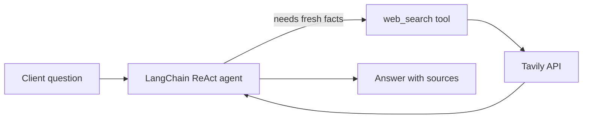

<p align="center">
  
</p>

# LangChain Search Agent

A minimal **agentic search assistant** that answers client questions using a LangChain ReAct agent and **Tavily web search**. Ask anything — the agent decides when to search the web, synthesizes an answer, and cites sources when relevant.

**Repo context:** This is **project #3** in the [`agentic_ai`](../README.md) collection. Recommended exploration order: #1 [Holiday Planner](../agent_mcp_rag/README.md) → #2 [Chemistry Video API](../ai_agent_video_generation/ai_agent_chemistry/README.md) → **#3 this project**.

## How this project fits

| # | Project | Relationship to this agent |
|---|---------|----------------------------|
| 1 | `agent_mcp_rag` | Full planner built on the same idea: an LLM that calls tools (MCP + RAG + Tavily) to complete a task. |
| 2 | `ai_agent_chemistry` | Service wrapper around a generation pipeline; this project is the smallest CLI agent slice. |
| 3 | **This project** | One tool (`web_search`), one agent loop — the foundation for tool-calling in #1. |

See [How the projects relate](../README.md#how-the-projects-relate) in the root README.

---

## Setup

### Prerequisites

- Python 3.11+
- API keys in `.env` at project root (`agent_with_tools/.env`):

```env
TAVILY_API_KEY=your_tavily_key
GOOGLE_API_KEY=your_gemini_key
```

Copy from the template:

```bash
cp .env.example .env
```

Optional — use OpenRouter or OpenAI instead of Gemini:

```env
LLM_PROVIDER=openrouter
OPEN_ROUTER_AI_API_KEY=your_openrouter_key
LLM_MODEL=meta-llama/llama-3.3-70b-instruct:free
```

### Install

Each project has its own `.venv` inside the project folder.

```bash
cd agent_with_tools
make install
source .venv/bin/activate
```

---

## Run

### Interactive mode (default)

Keeps accepting questions until you type `exit`, `quit`, or `q`.

```bash
make run-agent
```

Or directly:

```bash
cd src && python agent.py
cd src && python agent.py -i
```

### Single question

```bash
cd src && python agent.py "What is the latest news about agentic AI?"
```

Or via environment variable:

```env
USER_QUERY=What is the capital of France?
```

```bash
make run-agent
```

---

## How it works



1. Client asks a question (CLI or interactive).
2. The agent chooses whether to call `web_search`.
3. Tavily returns summaries and source snippets.
4. The agent writes a final answer and cites URLs when search was used.

---

## Configuration

| Variable | Default | Description |
|----------|---------|-------------|
| `TAVILY_API_KEY` | — | Required for web search |
| `GOOGLE_API_KEY` | — | Required when `LLM_PROVIDER=google` |
| `LLM_PROVIDER` | `google` | `google`, `openrouter`, or `openai` |
| `LLM_MODEL` | `gemini-2.5-flash-lite` | Model name for the chosen provider |
| `OPEN_ROUTER_AI_API_KEY` | — | Required when `LLM_PROVIDER=openrouter` |
| `OPENAI_API_KEY` | — | Required when `LLM_PROVIDER=openai` |
| `USER_QUERY` | — | Single-shot question (skips interactive prompt) |

---

## Makefile targets

| Target | Description |
|--------|-------------|
| `make install` | Create `.venv` and install `requirements.txt` |
| `make run-agent` | Run the search agent (`ARGS="your question"` for one-shot) |
| `make activate` | Print `source .venv/bin/activate` |
| `make reinstall` | Remove `.venv` and install fresh |
| `make clean-venv` | Remove local `.venv` |
| `make help` | List all targets |

---

## Project layout

```text
agent_with_tools/
  .venv/              # local virtual environment
  assets/
    readme-cover.png
  README.md
  Makefile
  requirements.txt
  .env.example
  src/
    agent.py          # agent + web_search tool + CLI
```

---

## Example session

```text
Search agent ready (model=gemini-2.5-flash-lite). Type 'exit' to quit.

Client> What is the current population of Tokyo?

Client: What is the current population of Tokyo?

Agent: Tokyo's population is approximately 14 million in the city proper ...
       Sources: ...
```

---

## License / notes

Part of the `agentic_ai` learning repository. For local development only; do not commit `.env` or API keys.
