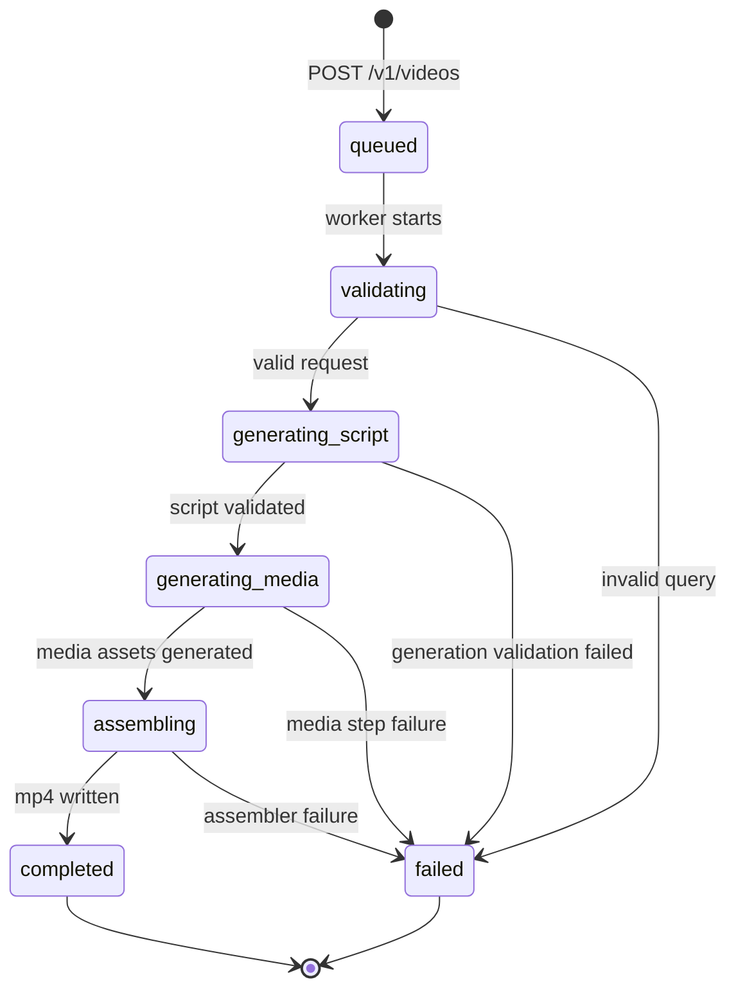
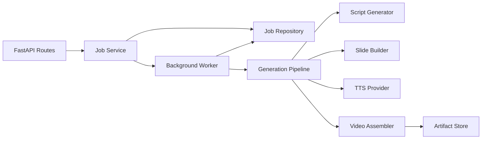

# Architecture Note

## Overview

The service is a backend-only asynchronous video request system. Clients submit a chemistry query, receive a job id immediately, poll status, and download the generated artifact when ready.

The design emphasizes:

- clear job-state lifecycle
- separation of API, orchestration, generation, persistence, and artifact storage
- reliability guardrails for non-deterministic generation steps
- easy swap from in-memory storage to database-backed storage later

## Job Lifecycle

## Boundaries

Rules:

- Routes do not directly call generation providers.
- Worker controls state transitions and retries.
- Pipeline controls generation steps.
- Repository and artifact store are replaceable adapters.

## Persistence and Artifacts

- Job persistence: in-memory repository behind interface.
- Artifacts: local disk files under `artifacts/videos` and metadata under `artifacts/manifests`.

This keeps demo setup simple while preserving an upgrade path to database + object storage.

## Reliability Approach

- Allowlist validation for required three chemistry queries.
- Retry (bounded) for transient generation/assembly failures.
- Relevance validation on generated script (required keywords by query).
- Fallback script templates for required topics when generation repeatedly fails.
- Structured failure payload (`failed_step`, `error_code`, `error_message`).

## Cost Strategy

- Template-first script generation to minimize model calls.
- Slide-based visual generation (cheap and deterministic).
- Local assembly path using ffmpeg subprocess.
- Cost estimate stored per job in metadata fields.

Estimated target: low cents or less per demo video in this prototype.

## Extensibility

The API accepts `topic` and uses a topic-aware validator and script template registry. New STEM topics can be introduced by:

1. adding topic validators
2. adding topic prompt/template providers
3. keeping orchestration unchanged
