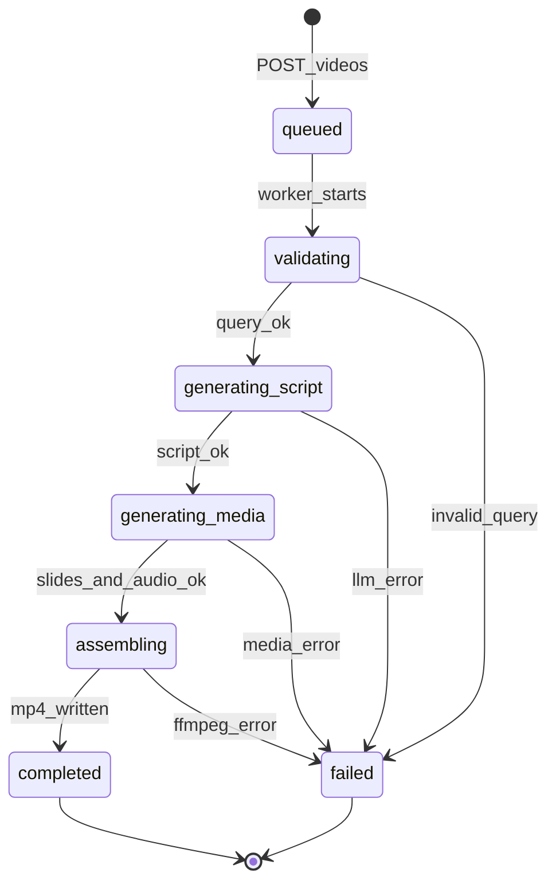
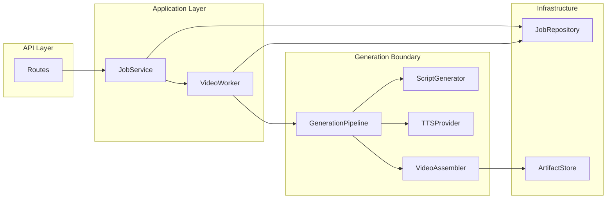

# AI Chemistry Video Challenge — Full Implementation Playbook

This guide maps directly to [ai_agent_chemistry/thinking.md](ai_agent_chemistry/thinking.md). The repo is greenfield today; treat this as your execution blueprint from zero to submission.

---

## How reviewers think (read this first)

Growtrics explicitly **does not** grade “did you finish everything.” They grade:

| Dimension | What “strong” looks like |
|-----------|-------------------------|
| Product judgement | You chose a thin, coherent slice; fakes are labeled; API matches the story |
| Architecture | Clear job lifecycle, boundaries, extensibility to other STEM topics |
| AI-agent workflow | You planned, steered, verified, and recovered from bad agent output |
| Quality | Understandable demo, sensible errors, some tests/observability |
| Video output | Coherent, on-topic, visually acceptable, **cost-conscious** |
| Reliability | Repeatable runs for all 3 queries; failures are explicit, not random crashes |

Your narrative in README + architecture note matters as much as code.

---

## Recommended time budget (90–120 min)

```mermaid
gantt
    title Suggested session split
    dateFormat X
    axisFormat %M min

    section Plan
    Scope_and_API_sketch           :0, 15

    section Build
    FastAPI_skeleton_and_jobs      :15, 35
    Generation_pipeline_MVP        :35, 70
    Reliability_and_tests          :70, 85

    section Ship
    Run_3_queries_commit_videos  :85, 100
    README_arch_note_demo          :100, 115
```



If you run over, **cut scope** (e.g. skip fancy animations) before cutting job-state clarity or the 3 end-to-end demos.

---

## Phase 1 — Planning (15–20 min)

### 1.1 Write a one-page “build contract” (before coding)

Create `ai_agent_chemistry/PLAN.md` (or top of architecture note) with:

1. **In scope (MVP)**
   - FastAPI service with async jobs
   - 3 fixed chemistry queries working end-to-end
   - MP4 artifact with voice + visuals (slides/diagrams acceptable)
   - List jobs, poll status, download/stream completed video

2. **Explicitly out of scope**
   - Frontend, auth, multi-tenant billing, cloud deploy, arbitrary chemistry topics

3. **What you will fake vs implement**
   - **Real**: job state machine, API, persistence boundary, artifact store, orchestration, validation/retries
   - **Acceptable to mock**: image generation (use templated slides/diagrams); optional “provider interface” with one real + one stub implementation

4. **Success definition for the session**
   - All 3 queries reach `completed` at least once
   - Failed runs surface `failed` + `error_message`, not 500 loops
   - You can state approximate $/video in README

### 1.2 Product decisions (document tradeoffs)

Answer these in writing — reviewers want intentional choices:

| Decision | Pragmatic recommendation for 90–120 min |
|----------|-------------------------------------------|
| Async model | `BackgroundTasks` or `asyncio.create_task` + in-process worker (not Celery unless you already have it) |
| Persistence | In-memory job registry + `artifacts/` on disk for MP4s (clean interface so DB swap is obvious) |
| Video style | **Slide deck + TTS + ffmpeg/moviepy** (cheap, reliable, educational) vs full AI video (expensive, flaky) |
| LLM role | Script + slide outline + validation only — not frame-by-frame video gen |
| Topic extensibility | `topic: chemistry` field + `ConceptValidator` interface; chemistry rules in one module |

### 1.3 API sketch (freeze before agent coding)

Minimal REST surface:

| Method | Path | Purpose |
|--------|------|---------|
| `POST` | `/v1/videos` | Create job (`query`, optional `topic`) |
| `GET` | `/v1/videos` | List jobs (filter by `status`) |
| `GET` | `/v1/videos/{job_id}` | Job detail + status |
| `GET` | `/v1/videos/{job_id}/artifact` | Stream/download MP4 when `completed` |
| `GET` | `/health` | Liveness |

Request body example:

```json
{ "query": "How does the pH scale work?", "topic": "chemistry" }
```

Job status enum (use consistently everywhere):

`queued` → `validating` → `generating_script` → `generating_media` → `assembling` → `completed` | `failed`

### 1.4 Agent workflow plan (how you use Cursor)

Break implementation into **5 agent prompts**, not one giant prompt:

1. Scaffold FastAPI + models + in-memory repo
2. Job runner + state transitions
3. Generation pipeline (script → slides → audio → video)
4. Reliability (validation, retries, errors)
5. README, tests, demo script

After each step: run API manually, fix before moving on.

---

## Phase 2 — Architecture (20–30 min design, then implement)

### 2.1 Layered structure (recommended layout)

```
ai_agent_chemistry/
├── app/
│   ├── main.py                 # FastAPI app, routes
│   ├── api/
│   │   ├── routes/videos.py
│   │   └── schemas.py          # Pydantic request/response
│   ├── domain/
│   │   ├── models.py           # VideoJob, JobStatus
│   │   └── exceptions.py
│   ├── services/
│   │   ├── job_service.py      # create/list/get; enqueue work
│   │   └── video_worker.py     # async pipeline orchestration
│   ├── generation/             # *** plug-in boundary ***
│   │   ├── pipeline.py         # orchestrates steps
│   │   ├── script_generator.py # LLM
│   │   ├── slide_builder.py    # images/PIL
│   │   ├── tts.py              # audio
│   │   ├── assembler.py        # ffmpeg/moviepy
│   │   └── validators.py       # chemistry + content checks
│   ├── persistence/
│   │   ├── job_repository.py   # Protocol/ABC
│   │   └── memory_repository.py
│   └── storage/
│       └── artifact_store.py   # save MP4, return path/URL
├── artifacts/                  # generated MP4s (gitignore except 3 best)
├── submissions/                # committed “best 3” + query.txt per video
├── tests/
├── ARCHITECTURE.md
├── README.md
├── requirements.txt
└── .env.example
```

### 2.2 Job lifecycle (core diagram for ARCHITECTURE.md)



### 2.3 Boundaries reviewers care about



**Rules:**
- Routes never call OpenAI/ffmpeg directly
- `GenerationPipeline` is the only place that knows step order
- Swapping “real AI video API” later = new class implementing same interface as `assembler` / `slide_builder`

### 2.4 Extensibility to other STEM topics

- `topic` enum: `chemistry` (only implemented validator for MVP)
- `ConceptValidator.validate(query, topic)` — chemistry module checks:
  - query is non-empty
  - optional: keyword/heuristic or LLM “is this chemistry?” guard
- Pipeline receives `topic` and selects validator + prompt template

### 2.5 Cost-conscious generation stack (recommended)

| Step | Tool | Why |
|------|------|-----|
| Script + slide bullets | `gpt-4o-mini` or similar small model | Cheap, good enough for 60–90s explainer |
| Slides | Pillow: text on colored backgrounds + simple diagrams | Predictable, no per-image API cost |
| Audio | `edge-tts` (free) or OpenAI TTS if quality needed | Clear narration |
| Video | `ffmpeg` or `moviepy` | Concat slides + audio → MP4 |

**Avoid for MVP:** Runway, Sora, per-frame DALL·E — high cost and flaky within 2 hours.

Document rough cost in README, e.g.:
- Script LLM: ~2–5k tokens → $0.001–0.01
- TTS: $0 if edge-tts
- **Total target: < $0.05/video** for demo

### 2.6 Reliability design (non-determinism engineering)

Implement **at the generation boundary**, not sprinkled in routes:

1. **Structured LLM output** — JSON schema: `{ title, scenes: [{ narration, on_screen_text, duration_sec }] }`
2. **Validation gates**
   - Parse JSON; retry up to 2× with “fix JSON” prompt
   - Check scene count (e.g. 4–8), total duration band (45–120s)
   - **Relevance check**: LLM or heuristic — narration must mention key terms from user query
3. **Idempotent artifact paths** — `artifacts/{job_id}.mp4` so retries overwrite safely
4. **Retries with backoff** — LLM and TTS only; don’t infinite-loop ffmpeg
5. **Fallback script** — static template per known query if all LLM retries fail (ensures 3 demos complete)
6. **Failure transparency** — persist `error_code`, `error_message`, `failed_step` on job

---

## Phase 3 — Implementation (step-by-step)

### Step 0 — Environment

```bash
cd ai_agent_chemistry
python -m venv .venv && source .venv/bin/activate
pip install fastapi uvicorn pydantic python-dotenv httpx pillow moviepy edge-tts
# system: ffmpeg installed (brew install ffmpeg)
```

`.env.example`: `OPENAI_API_KEY=`, `ARTIFACT_DIR=./artifacts`

### Step 1 — Domain models + repository (30 min)

`VideoJob` fields:
- `id`, `query`, `topic`, `status`, `created_at`, `updated_at`
- `artifact_path`, `error_message`, `failed_step`
- optional: `progress` (0–100), `metadata` (cost estimate, duration)

`JobRepository` protocol: `create`, `get`, `list`, `update`

### Step 2 — FastAPI routes (20 min)

- `POST /v1/videos` → create job `queued`, return `202` + `job_id`
- Kick off background task: `asyncio.create_task(worker.process(job_id))`
- `GET` list/detail — never block on generation
- `GET .../artifact` → `FileResponse` if `completed`, else `409` with current status

Enable OpenAPI (`/docs`) for demo — reviewers appreciate curl + Swagger.

### Step 3 — Generation pipeline (40–50 min)

**Pipeline steps** (each updates job status):

1. `validating` — validator accepts query; for MVP allow the 3 known queries + generic chemistry-like text
2. `generating_script` — LLM returns structured scenes
3. `generating_media` — per scene: render PNG slide, generate audio clip (or one full narration)
4. `assembling` — ffmpeg concat → MP4
5. `completed` — write path to job

**Prompt tips for educational quality:**
- Audience: secondary school chemistry
- Structure: hook → definition → example → recap
- Force on-screen text to be short bullets
- Mention learner’s exact question in scene 1

### Step 4 — Reliability hooks (15–20 min)

- Wrap LLM call in `tenacity` or manual retry (max 2)
- `validators.validate_script(script, query)` before media step
- On failure: set `failed`, log exception server-side

### Step 5 — Observability (10 min)

- Structured logging: `job_id`, `status`, `step`, `duration_ms`
- Optional: `GET /v1/videos/{id}/events` or include `logs` array on job (last N lines) — strong signal for reviewers

### Step 6 — Tests (15–20 min, high ROI)

| Test | Assert |
|------|--------|
| `test_create_job_returns_202` | status `queued` |
| `test_get_unknown_job_404` | |
| `test_validator_rejects_empty_query` | `failed` or 400 |
| `test_pipeline_with_mocked_llm` | reaches `completed`, artifact exists |
| `test_list_jobs_filter` | |

Use `pytest` + `TestClient`; mock `ScriptGenerator` to return fixed JSON for speed.

### Step 7 — Run the three required queries

```bash
# Example flow
curl -X POST localhost:8000/v1/videos -H "Content-Type: application/json" \
  -d '{"query":"How does the pH scale work?","topic":"chemistry"}'

curl localhost:8000/v1/videos/{id}
# poll until completed

curl -O localhost:8000/v1/videos/{id}/artifact
```

Run each query **twice** if time allows — note consistency in architecture note.

Pick **best 3 MP4s**, copy to `submissions/` with sidecar `query.txt`:

```
submissions/
  ph_scale.mp4
  ph_scale.query.txt
  covalent_bonds.mp4
  ...
```

---

## Phase 4 — Evaluation (self-assessment before submit)

### 4.1 Rubric checklist (grade yourself honestly)

**API & backend**
- [ ] OpenAPI documents all endpoints
- [ ] Status enum used consistently; no “stuck” jobs without explanation
- [ ] Errors are JSON with stable shape `{ "detail": "...", "job_id": "..." }`
- [ ] Artifact endpoint only when `completed`

**Architecture**
- [ ] ARCHITECTURE.md has lifecycle diagram + boundary explanation
- [ ] Clear where to plug real video AI vendor later
- [ ] STEM extensibility explained in 1 paragraph

**Reliability**
- [ ] All 3 required queries completed at least once
- [ ] Scripted fallback or retries documented
- [ ] Validation prevents empty/garbage videos

**Video quality**
- [ ] Audio understandable, synced reasonably with slides
- [ ] Content matches query (mentions pH / covalent / ionic as appropriate)
- [ ] Length appropriate (~1–2 min, not 10 s placeholder)

**Cost**
- [ ] README states tools used and estimated $/video
- [ ] You chose cheap visuals deliberately

**AI-agent workflow (for your recording / README)**
- [ ] You can point to 3–5 incremental commits or steps
- [ ] You fixed at least one agent mistake visibly

### 4.2 What reviewers will do with your repo

1. Read README → run server → hit `/docs`
2. Skim ARCHITECTURE.md for judgement
3. Watch committed MP4s (not re-run generation)
4. Maybe run tests

Optimize for **first 10 minutes of reviewer experience**.

---

## Phase 5 — Deliverables & submission

| Deliverable | Action |
|-------------|--------|
| Codebase | Everything under `ai_agent_chemistry/` |
| README | Setup, env vars, `uvicorn` command, curl examples for 3 queries, test command |
| ARCHITECTURE.md | Lifecycle, persistence, generation boundary, reliability, cost, extensibility |
| Demo | Screen recording: POST → poll → download → play MP4 for 1 query (or all 3 quickly) |
| 3 best videos | In `submissions/` with query sidecars; **commit to git** |
| GitHub access | Invite `praveen.k@growtrics.ai`, `tech@growtrics.ai` |
| Zip | Repo minus `.venv`, include artifacts or submissions folder |
| Work recording | Zoom solo: face + screen for full session |

### README template sections

1. Overview (2 sentences)
2. Quick start
3. API summary table
4. Job statuses
5. Generation approach & cost estimate
6. Reliability features
7. How to run tests
8. Known limitations / next steps

---

## Phase 6 — AI-agent prompting patterns (during build)

**Good prompt pattern:**
> “Implement `JobRepository` in-memory and `VideoJob` pydantic model per PLAN.md. Do not add routes yet. Add unit tests for create/get/update.”

**After each generation:**
> “Run pytest for tests/test_jobs.py. Fix failures only in repository layer.”

**When agent over-builds:**
> “Remove Celery/Redis. Use asyncio background task only. Keep diff under 200 lines.”

**When video pipeline breaks:**
> “Mock ScriptGenerator in tests. Debug assembler with a single 5s slide + 5s audio fixture.”

---

## Common pitfalls to avoid

- Spending 60 min on Docker/K8s instead of job lifecycle
- Returning MP4 synchronously from POST (hides async design)
- No `failed` state — jobs hang forever
- Generated video unrelated to query (no validation)
- Committing API keys or huge `.venv`
- Only documenting happy path — reviewers test bad `job_id`

---

## Suggested “strong but small” MVP definition

If time is tight, ship this exact slice:

1. FastAPI + in-memory jobs + disk artifacts
2. Pipeline: LLM script → Pillow slides → edge-tts → ffmpeg
3. Status transitions + validation + 1 retry + fallback script for 3 known queries
4. pytest with mocked LLM + one integration test
5. Three MP4s in `submissions/`, README + ARCHITECTURE.md

Everything else (webhooks, S3, Celery, admin UI) is **bonus**, not required.

---

## Optional follow-up after submission

If you polish later: add `POST /v1/videos/{id}/retry`, Prometheus metrics, chemistry-specific diagram templates (pH color bar, Lewis structures), and a `ProviderRegistry` for TTS/LLM vendors.

