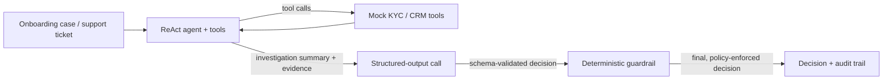

# Finance Agent — Interview Prep Demo

> **Not affiliated with any company.** This is a personal practice project built to
> rehearse for an "Applied AI Engineer" style interview at a fintech company. All
> data (names, accounts, watchlist entries, tickets) is synthetic and made up —
> there is no real customer data, PII, or connection to any real KYC/AML vendor,
> CRM, or core banking system anywhere in this folder.

Two small tool-calling agents for practical financial workflows:

- **`kyc_agent`** — reviews a mock customer onboarding case (ID format, sanctions/PEP
  watchlist screen, document-vs-form consistency) and produces an `approve` /
  `reject` / `escalate` decision.
- **`support_agent`** — triages a mock support ticket (account lookup + knowledge-base
  retrieval) and produces a category, priority, and routing decision.

Both agents follow the same three-step pattern:

1. A **ReAct tool-calling agent** investigates by calling tools and writes a free-text summary.
2. A **structured-output call** turns that summary + raw tool evidence into a schema-validated decision (Pydantic).
3. A **deterministic guardrail** can override the model's decision when hard tool evidence contradicts it — the model never gets the final say on a watchlist hit, a failed ID check, or a low-confidence call.



---

## Why this shape

This maps directly onto the kind of role this was built to rehearse for — "build AI
agents, workflows, tools and automations" for practical financial workflows
(onboarding, KYC, support/CRM, risk review), designed around accuracy, hallucination
risk, latency, cost, security, compliance, and user trust, with evaluations and
guardrails as first-class concerns, not afterthoughts.

| JD theme | Where it shows up here |
|---|---|
| Build AI agents, tools, workflows | `create_agent` + custom tools in `src/kyc_agent.py`, `src/support_agent.py` |
| Tool calling | `src/tools.py` — typed tools with docstring-derived schemas |
| Retrieval | `search_knowledge_base` — keyword retrieval today; the seam where a vector DB would go in production |
| Structured, predictable output | `src/schemas.py` (Pydantic) + `.with_structured_output(...)` |
| Guardrails / hallucination risk | `src/guardrails.py` — tool evidence always overrides the model's stated decision |
| Evaluations | `tests/` (offline, deterministic) + `evals/` (live, LLM-based) |
| KYC, onboarding, CRM, support, risk review | `kyc_agent` = onboarding/KYC; `support_agent` = CRM/support triage |
| Latency, cost awareness | Every run reports wall-clock latency; `temperature=0` for reproducible decisions |
| Ship it, don't just demo it | Deterministic guardrails + a real (if small) eval suite, not just a prompt that "usually works" |

---

## Setup

```bash
cd finance_agent
cp .env.example .env   # add one provider's API key
make install
source .venv/bin/activate
```

Default provider is Google Gemini (`GOOGLE_API_KEY`). To use OpenAI or OpenRouter
instead, set `LLM_PROVIDER` in `.env` — see `.env.example` for both.

---

## Run

### KYC review agent

```bash
make run-kyc
# or with a custom case:
make run-kyc CASE_FILE=path/to/case.json
```

Example output:

```text
Case: Nguyen Van Rui (national_id)
Final status: ESCALATE  (confidence=0.95)
  [guardrail overrode model decision: model said 'approve']
  - guardrail: watchlist hit forces manual escalation
  latency: 2.1s
```

### Support triage agent

```bash
make run-support
# or: make run-support TICKET_FILE=path/to/ticket.json
```

A case/ticket JSON file looks like:

```json
{
  "full_name": "Le Thi Mai",
  "id_type": "national_id",
  "id_number": "012345678901",
  "name_on_document": "Le Thi Mai",
  "dob_on_form": "1995-04-02",
  "dob_on_document": "1995-04-02"
}
```

```json
{
  "account_id": "ACC-1002",
  "message": "My card payment keeps getting declined."
}
```

---

## Testing and evaluation

Two different layers, on purpose — this is the "evaluations" part of the JD made concrete:

```bash
make test   # offline unit tests — no API key, no network, runs in <1s
make eval   # live end-to-end eval — calls the real LLM, needs an API key
```

- **`tests/`** — pure unit tests for `tools.py` and `guardrails.py`. These check the
  deterministic parts of the system (regex checks, watchlist lookups, guardrail
  overrides) and never call an LLM, so they're fast, free, and 100% reproducible in CI.
- **`evals/`** — end-to-end fixtures (`kyc_cases.jsonl`, `support_cases.jsonl`) run
  against the live agents. KYC cases are **hard checks**: guardrail-enforced
  invariants that must hold regardless of model variance (e.g. a watchlist hit must
  never end in `approve`). Support cases are **soft checks**: expected model
  classifications, reported but not treated as a hard failure, since routing a
  slightly ambiguous ticket is a judgment call, not a bug.

---

## Design notes / talking points

Things worth being able to explain out loud, since this project exists to practice that:

- **Why two stages (investigate, then decide) instead of one agent call?** Separating
  "gather evidence" from "produce a schema-validated decision" means the final output
  is always parseable and typed, instead of hoping the agent's last message happens to
  be valid JSON.
- **Why guardrails live outside the LLM?** Confidence scores are the model's opinion of
  itself, not a calibrated probability. For irreversible or compliance-sensitive
  actions (approving a KYC case, closing a fraud ticket as low-priority), the system
  should not let the model overrule a hard fact a tool already returned.
  `apply_kyc_guardrails` and `apply_ticket_guardrails` show this as literal code, not
  just a prompt instruction — the same policy can be unit-tested (see `tests/test_guardrails.py`)
  without ever calling a model.
- **What's mocked vs. what would change in production:** `tools.py` uses in-memory
  dicts for the watchlist, accounts, and knowledge base. In production these become
  a sanctions-screening vendor API, a CRM/core-banking lookup, and a vector DB
  retrieval call — the agent and guardrail code doesn't need to change, only the tool
  implementations.
- **What's missing for real production use:** audit logging to a durable store, PII
  redaction before any data reaches the LLM provider, rate limiting / retries on tool
  and LLM calls, a human-review UI for `escalate` outcomes, and a much larger,
  continuously-updated eval set instead of four hand-written cases.

---

## Project layout

```text
finance_agent/
├── README.md
├── Makefile
├── requirements.txt
├── pytest.ini
├── .env.example
├── src/
│   ├── llm.py              # provider factory (Gemini / OpenAI / OpenRouter)
│   ├── schemas.py          # Pydantic decision contracts
│   ├── tools.py            # mock KYC + CRM/support tools
│   ├── guardrails.py       # deterministic policy overrides
│   ├── kyc_agent.py        # onboarding/KYC review agent + CLI
│   └── support_agent.py    # support/CRM triage agent + CLI
├── tests/                  # offline unit tests (no API key needed)
│   ├── test_tools.py
│   └── test_guardrails.py
└── evals/                  # live end-to-end eval harness (needs an API key)
    ├── kyc_cases.jsonl
    ├── support_cases.jsonl
    └── run_evals.py
```

---

## Makefile targets

| Target | Description |
|---|---|
| `make install` | Create `.venv` and install dependencies |
| `make run-kyc` | Run the KYC review agent (`CASE_FILE=path` optional) |
| `make run-support` | Run the support triage agent (`TICKET_FILE=path` optional) |
| `make test` | Run offline unit tests — no API key needed |
| `make eval` | Run the live end-to-end eval harness — needs an API key |
| `make activate` | Print `source .venv/bin/activate` |
| `make reinstall` | Remove `.venv` and install fresh |
| `make clean-venv` | Remove local `.venv` |
| `make help` | List all targets |

---

## License / notes

Part of the `agentic_ai` learning repository. For local practice only; do not commit `.env` or API keys.
